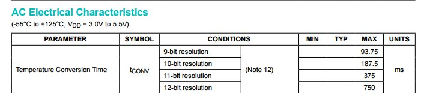

## Hvor raskt/ofte kan jeg måle med Dallas sensoren?
Må finne databladet for DS18B20 : https://datasheets.maximintegrated.com/en/ds/DS18B20.pdf

På side 5 står det:

The resolution of the temperature sensor is user-configurable to 9, 10, 11, or 12 bits,

corresponding to increments of 0.5°C, 0.25°C, 0.125°C, and 0.0625°C, respectively. 

The default resolution at power-up is 12-bit.

På side 3 er det en tabell som heter AC Electrical Characteristics

  

## Hva betyr dette i praksis for meg?

Hvis jeg vil måle oftere enn 2 ganger i sekundet må jeg endre oppløsningen til temperatursensoren.

## Hvordan gjør jeg dette?
